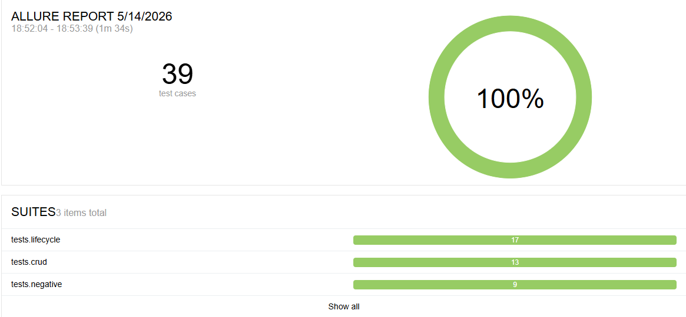
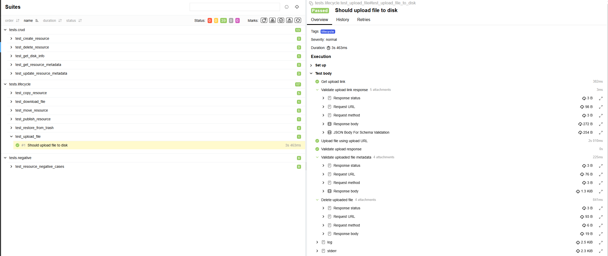
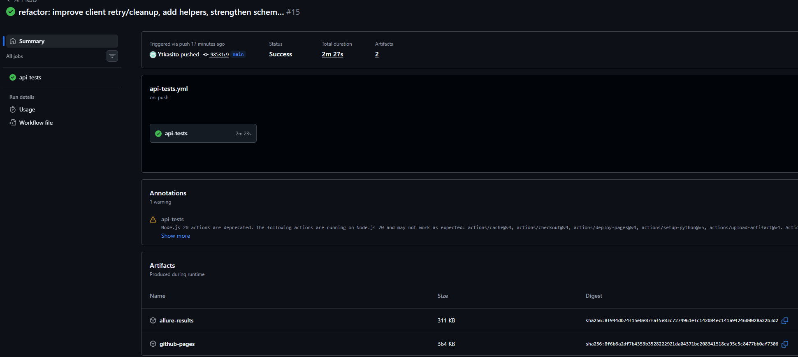

<div align="center">

# Автотесты REST API Яндекс.Диска

# Yandex Disk API Tests

Полноценный framework для автоматизированного тестирования REST API сервиса Яндекс.Диск.

Проект демонстрирует навыки построения API automation framework с использованием Python, Pytest, Requests, Allure Report и CI/CD.

[](https://www.python.org/)
[](https://pytest.org/)
[](https://requests.readthedocs.io/)
[](https://allurereport.org/)
[](https://github.com/Ytkasito/yandex-disk-api-tests/actions/workflows/api-tests.yml)


</div>

---

# Live Allure Report

[Open Allure Report](https://ytkasito.github.io/yandex-disk-api-tests/)

---

# Allure Report

## Overview



---

## Detailed Test Execution



---

# CI/CD Pipeline



---

# Key Features

- REST API testing
- CRUD operations coverage
- Lifecycle testing
- Negative testing
- JSON Schema validation
- Reusable API client
- Request/response logging
- Custom assertions
- Allure reporting
- GitHub Actions CI/CD
- Live Allure Report via GitHub Pages
- Scalable test architecture

---

## О проекте

Проект представляет собой полноценный framework для автоматизированного тестирования REST API Яндекс.Диска.

Основная цель проекта — покрытие ключевых пользовательских сценариев API:

- CRUD-операции с ресурсами
- загрузка и скачивание файлов
- работа с публичными ссылками
- проверка асинхронных операций
- негативные сценарии
- валидация JSON-схем
- логирование запросов и ответов
- генерация детализированных Allure-отчётов

Проект построен с упором на:

- читаемость тестов
- переиспользуемость кода
- масштабируемость
- поддержку CI/CD
- удобство анализа результатов тестирования

---

# Технологический стек

| Технология | Назначение |
|---|---|
| Python 3.12 | Основной язык разработки |
| Pytest | Фреймворк для запуска тестов |
| Requests | HTTP-клиент для API-запросов |
| Allure Report | Генерация HTML-отчётов |
| JSON Schema | Валидация структуры ответов |
| python-dotenv | Работа с переменными окружения |
| GitHub Actions | CI/CD пайплайн |
| GitHub Pages | Публикация Allure Report |
| Ruff | Линтинг и проверка качества кода |
| Black | Автоматическое форматирование кода |

---

# Архитектура проекта

```text
yandex-disk-api-tests
│
├── .github
│   └── workflows
│       └── api-tests.yml          # CI/CD пайплайн GitHub Actions
│
├── schemas                        # JSON-схемы API-ответов
│   ├── disk_info_schema.py
│   ├── error_schema.py
│   ├── link_schema.py
│   ├── operation_schema.py
│   └── resource_schema.py
│
├── test_data                      # Тестовые файлы
│   └── hello.txt
│
├── tests
│   ├── conftest.py                # Фикстуры и общая конфигурация
│   │
│   ├── crud                       # CRUD-сценарии
│   │   ├── test_create_resource.py
│   │   ├── test_delete_resource.py
│   │   ├── test_get_disk_info.py
│   │   ├── test_get_resource_metadata.py
│   │   └── test_update_resource_metadata.py
│   │
│   ├── lifecycle                  # Жизненный цикл ресурсов
│   │   ├── test_copy_resource.py
│   │   ├── test_download_file.py
│   │   ├── test_move_resource.py
│   │   ├── test_publish_resource.py
│   │   ├── test_restore_from_trash.py
│   │   └── test_upload_file.py
│   │
│   └── negative                   # Негативные сценарии
│       └── test_resource_negative_cases.py
│
├── utils
│   ├── assertions.py              # Кастомные проверки
│   ├── client.py                  # API-клиент Яндекс.Диска
│   └── logger.py                  # Логирование запросов
│
├── .env.example
├── .gitignore
├── pytest.ini
├── requirements.txt
└── README.md
```

---

# Установка проекта

## 1. Клонирование репозитория

```bash
git clone https://github.com/Ytkasito/yandex-disk-api-tests.git
cd yandex-disk-api-tests
```

---

## 2. Создание виртуального окружения

### Windows

```bash
python -m venv venv
venv\Scripts\activate
```

### Linux / macOS

```bash
python3 -m venv venv
source venv/bin/activate
```

---

## 3. Установка зависимостей

```bash
pip install -r requirements.txt
```

---

## 4. Настройка переменных окружения

Создать файл `.env` в корне проекта:

```env
BASE_URL=https://cloud-api.yandex.net
TOKEN=your_oauth_token
```

Получить OAuth-токен можно через:

https://oauth.yandex.ru/

---

# Запуск тестов

## Запуск всех тестов

```bash
pytest
```

---

## Запуск с Allure

```bash
pytest -v --alluredir=allure-results
allure serve allure-results
```

---

## Запуск по маркерам

### CRUD

```bash
pytest -m crud
```

### Lifecycle

```bash
pytest -m lifecycle
```

### Negative

```bash
pytest -m negative
```

---

# Code Quality

## Ruff

```bash
ruff check .
ruff check . --fix
```

## Black

```bash
black .
black --check .
```

# CI/CD

Проект автоматически запускает тесты через GitHub Actions.

Pipeline выполняет:

1. Установку зависимостей
2. Проверку кода через Ruff
3. Проверку форматирования Black
4. Запуск тестов
5. Генерацию Allure Report
6. Публикацию отчёта на GitHub Pages

Workflow запускается:

- при push в ветку `main`
- при Pull Request

---

# Настройка GitHub Secrets

Для работы CI необходимо добавить секрет:

```text
TOKEN
```

Путь:

```text
Settings → Secrets and variables → Actions → New repository secret
```

---

# Что демонстрирует проект

Проект демонстрирует навыки:

- API Testing
- REST Architecture
- Python Automation
- Pytest Framework
- Работа с HTTP
- JSON Schema Validation
- Работа с фикстурами
- Построение тестовой архитектуры
- CI/CD интеграция
- Работа с Allure Report
- Git/GitHub

---


# Автор

Проект разработан как pet-project для практики автоматизированного тестирования REST API и демонстрации навыков QA Automation.

---

# Контакты

GitHub:

https://github.com/Ytkasito

Telegram:

@Inckavo

Mail:

kira090801@mail.ru